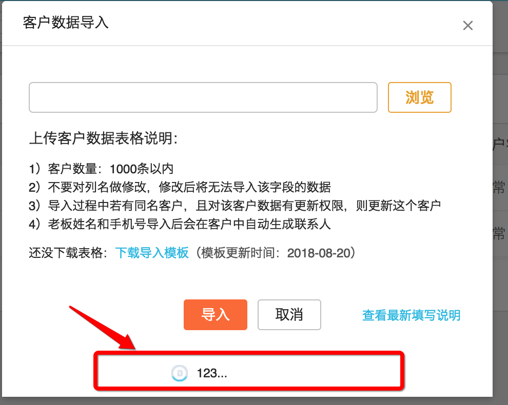

#Loading插件

##背景
发现现在项目中虽然有loading遮罩的方法，但是满足不了要求，都是固定区域的遮罩，即使有局部的遮罩也存在问题，并且在使用时不太方便；

##已存在的遮罩方法
* 固定区域的方法：
	1. app.uiUtil.showLoading()/app.uiUtil.hideLoading()；id="loadingIndicator"；
	2. appCommon.uiUtils.showManualLoading()/appCommon.uiUtils.hideManualLoading()； id="manualFullLoading"；
	3. appCommon.uiUtils.showLoading()/appCommon.uiUtils.hideLoading()；id="fullLoading"；
	5. appCommon.uiUtils.showLoadingForContent()/appCommon.uiUtils.hideLoadingForContent()；id="globalContentLoading"，代账管理右边区域loading；
	6. appCommon.uiUtils.showLoadingForFull()/appCommon.uiUtils.hideLoadingForFull()；id="globalFullLoading"，代账管理右边区域loading；
	7. appCommon.uiUtils.showLoadingCanCancel(callback)/appCommon.uiUtils.hideLoadingCanCancel()；id="loadingCanCancel"，可取消的loading；
	

* 自定义区域loading
	1. appCommon.uiUtils.showLoadingForTable($parent, text)/appCommon.uiUtils.hideLoadingForTable($parent, text)；表格内loading；
	2. appCommon.uiUtils.showLoadingForInput($parent)/appCommon.uiUtils.hideLoadingForInput($parent)；输入框中的loading；
	3. appCommon.uiUtils.showLoadingForSection($parent, text)/appCommon.uiUtils.hideLoadingForSection$parent)；小区域loading；

* **总结：**
	1. 固定区域的遮罩，要求必须html元素中存才需要的id，然而在使用时发现有些id并不存在，例如：早17代账页面中，id为“manualFullLoading”的元素并不存在；如果手动在某个元素上增加id，那么在同一个页面中只能使用一次，否则会造成id重复； 
	2. 自定义区域的loading，在使用时发现是在所选dom里追加一个遮罩的dom节点，不过没有考虑遮罩曾的问题，这个追加的节点会显示在素选元素最底部，并没有达到loading遮罩的效果；例如：appCommon.uiUtils.showLoadingForSection($parent, text)的效果去下图
	3. 使用loading场景最多的大概就是发起向服务端请求数据的时候吧，在请求发出时显示遮罩，数据返回后隐藏遮罩；以上方法在使用上都需要手动调用对应的show或者hide方法，只单独发送一个请求时，调用show或者hide的方法的时机比较好掌握；但是往往存在数据依赖的情况，比如这个操作或者请求的参数需要另一个请求或者多个请求的返回的结果，这种情况下，显示遮罩的位置比较好判断，但是隐藏遮罩的时机呢？在最后一个请求发挥结果的位置肯定是需要隐藏的，那么万一在中间某个请求出错了呢？或者在满足某种条件下，就不需要后面的逻辑处理及数据请求了呢？那么就需要在很个节点处手动隐藏遮罩了，这样很容易漏掉或者出错的；

##想法
1. 遮罩能不能通用一点，只需要给一个参考的dom节点，就能在对应节点上生成一个遮罩；
2. 这个遮罩能不能“智能点”，会自定隐藏；
3. 能不能和http请求结合，请求发出的时候显示遮罩，请求结束后能自动隐藏掉；

##方案
1. 对于第一个问题，比较好解决，手动把遮罩的dom结构插入选择的节点中就好了；
2. 之前在使用Angular时，使用过angular-busy这个插件，这个插件是配合angular的$http服务的一个遮罩插件，其中$http服务返回的是一个promise对象，angular-busy接受一个promise参数，在promise的回调中执行隐藏遮罩的操作；正好项目总使用的$.ajax()和axios两个http请求工具都满足要求，所以这里也采用这用方式，实现自动隐藏遮罩的操作；

##问题
1. 项目中同时使用了Backbone和React两个框架，因为两个框架存在本质上的差别所以要提供两套插件来满足要求；
	* Banckbone框架为主的代码，可以写一个jQuery的插件来满足需求；
	* React部分需要写个React的插件了；
2. 项目中同时存在es5和es6两种规范的代码，所以Promise对象会存在两种，通过jQuery的$.Deferred()方法创建的和es6的new Promise()创建的；
	* 在jQuery插件中做兼容处理，判断是jQuery对象生成的Promise还会es6的Promise对象；
	* React的插件属于es6部分，所以这里只能使用es6的Promsie对象，也是为了后续代码规范，es6代码中尽量不要使用jQuery；

##API
**React Loading**

```Loading
import Loading from "./Loading";
import "./Loading.css";

<Loading loading={true}>
	<div>
		loading显示出来啦
	</div>
</Loading>
```
参数  | 说明 | 类型 | 默认值 | 是否必填 | 备注
---- |----- | ----|------ | ------- | ----
loading  | 是否显示遮罩 | Promise/Boolean | 无 | 是 | 不是Promise对象时需要通过，loading变量手动隐藏；为Promise对象的时候，会Promise的then()和catch()中自动隐藏遮罩的；
type | loading的类型 | String | default | 否 |类型有default progress（进度条）
size | loading的大小 | String | default | 否 | default large（大） small（小）
text | 显示文字 | String | 数据加载中，请稍后... | 否 |  
progress | 设置进度条的进度 | Number | 0 | 否 | 不传的情况下，会有一个假的自动的进度条效果，进度条加载进嘴最多到95%就不在上涨了
content | 自定义遮罩内容 | Element | 无 | 否 | 插件满足不了需求，用户可以使用该参数来自定义遮罩的内容和样式


**jQuery Loading**

* 常规使用

	```
		$(select).loading("show", options); //显示
		
		$(select).loading("hidden", options); //隐藏
	```

* 结合promise使用

	```
		$(select).loading(Promise, options);
	```
	
	```
		//es5
		function http(){
			var dtd = $.Deferred();
			setTimeout(dtd.resolve, 2000);
			// setTimeout(dtd.reject, 2000);
			// setTimeout(dtd.notify, 2000);
			return dtd;
		}
		
		function fn1(){
			console.log("fn1");
			var dtd = $.Deferred();
			setTimeout(dtd.resolve, 2000);
			return dtd;
		}
		function fn2(){
			var dtd = $.Deferred();
			console.log("fn2");
			dtd.resolve;
			return dtd;
		}
		
		var promise = http().then( fn1 ).then( fn2 );
		$("#table").loading( promise );
	```
	```
	//es6
	function http(){
		return new Promise((resolve,reject) => {
            setTimeout(() => {
                resolve(); //这里调resolve方法，则then方法会被调用
                console.log('http');
            }, 2000);
       });
	}
	
	function fn1(){
		return new Promise((resolve,reject) => {
            setTimeout(() => {
                resolve(); //这里调resolve方法，则then方法会被调用
                console.log('fn1');
            }, 2000);
       });
	}
	function fn2(){
		return new Promise((resolve,reject) => {
            resolve();
            console.log('fn2');
       });
	}
	
	var promise = http().then( fn1 ).then( fn2 );
	$("#table").loading( promise );
	```

promise：jQuery的Deferred()对象，或者es6的Promise对象;
options：配置参数，详情见下表；

参数  | 说明 | 类型 | 默认值 | 是否必填 | 备注
---- |----- | ----|------ | ------- | ----
type | loading的类型 | String | default | 否 |类型有default progress（进度条）
size | loading的大小 | String | default  | 否 | default large（大） small（小）
text | 显示文字 | String | 数据加载中，请稍后... | 否 | 
progress | 设置进度条的进度 | Number | 0 | 否 | 不传的情况下，会有一个假的自动的进度条效果，进度条加载进嘴最多到95%就不在上涨了
content | 自定义遮罩内容 | Element | 无 | 否 | 插件满足不了需求，用户可以使用该参数来自定义遮罩的内容和样式


##例子

1. [jQuery Dom](./dom/loading/test/index.html)
2. [React Dom](http://localhost:3000)

##总结
**React Loading**

```
	//遮罩处理
	loading = (promise) => {
	    if (promise && promise.then) {
	        this.setState({
	            loading: true
	        });
	        promise.then(() => {
	            this.setState({
	                loading: false
	            })
	        }).catch(() => {
	            this.setState({
	                loading: false
	            })
	        });
	    }
	};
```
	
**jQuery laoding**

```
	//如果已存在 保存一下
	var old = $.fn.loading;
	
	//挂载
	jQuery.loading = $.fn.loading = Plugin;
	
	// DROPDOWN NO CONFLICT
	// ====================
	
	//提供的一个切换到老的方法的方法
	$.fn.loading.noConflict = function () {
		$.fn.loading = old;
		return this;
	}
	
```
```
	//构造函数
	function Plugin(promise, options) {
		//合并配置参数
        var option = $.extend({}, Loading.DEFAULT, typeof options == "object" ? options : {});
        return this.each(function () {
            var $this = $(this);
            var data = $(this).data("znn.jq.loading");
            var options = option;

			//把创建的对象保存到dom的data属性上，这样在外面可以通过$(select).data("znn.jq.loaing")拿到这个对象
            $this.data("znn.jq.loading", (data = new Loading(promise, this, options)));
            //这里增加额外手动调用的方式，例如：$(select).loading("show", options);
            if (typeof promise == "string" && typeof data[promise] == "function") {
                data[promise]();
            }
        });
    }
```

```
	//暴露的原型链方法，方便后面从外部调用，例如：$(select).data("znn.jq.loaing").progress(90)
	Loading.prototype.show = function(){}
	Loading.prototype.hidden = function(){}
	Loading.prototype.progress = function(){}
```

```
	//动态加载相关的静态资源
	function _addStyle() {
        var style = document.createElement('link'); //创建一个style元素
        var head = document.head || document.getElementsByTagName('head')[0]; //获取head元素
        style.rel = 'stylesheet'; //这里必须显示设置style元素的type属性为text/css，否则在ie中不起作用
        style.setAttribute("href", CSS_PATH);
        head.appendChild(style); //把创建的style元素插入到head中
    }

	//获取资源引用的路径
    function _getCssPath() {
        $(document.scripts).each(function (index, el) {
            if (el.src.indexOf("loading.js") > -1) {
                BASE_PATH = el.src;
                CSS_PATH = el.src.replace("loading.js", "loading.css");
            }
        });
    }
```

```
	//遮罩处理
	if (self.promise.done) {
            //jqury的promise
            $.when(self.promise).then(
                function () {
                    self.hidden();
                }
            ).done(function () {
                self.hidden();
            })
                .fail(function () {
                    self.hidden();
                });
        } else if (self.promise.catch) {
            //es6的Promise
            self.promise.then(function () {
                self.hidden();
            }).catch(function () {
                self.hidden();
            })
        }
```